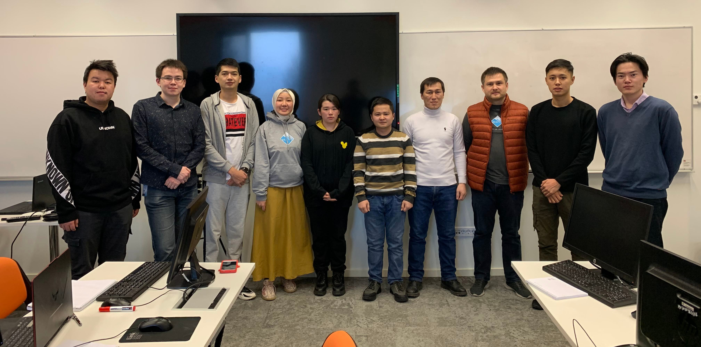

# Competitive-Programming-Bootcamp-December-2021
8 day long boot camp that was organized by University of Central Asia to improve our competitive programming skills and prepare us for the ICPC Northern Eurasia Finals 2021.

## Topics

Day 1 - Time Complexity Sorting and Searching  
Day 2 - Data Structures  
Day 3 - Dynamic Programming  
Day 4 - Dynamic Programming  
Day 5 - Dynamic Programming  
Day 6 - Graph Algorithms  
Day 7 - Graph Algorithms  
Day 8 - Range Queries, Number Theory  

## Organizers
Nurlan Shaidullaev  
Mukhammadmuso Abduzhabbarov  

## Mentors
Kylychbek Uraimov   
Mirbek Bakirov   
Omurbek Jamalov   

## Outline
Folders contains my solutions for questions we solved during the bootcamp. Every folder is divided into the topics exept the "All_In_One_Folder" where you can check all my solutions in one place.
 
 
Main programming language of the bootcamp was C++.
 
 
103 solutions had been created in 8 days.

## Group Photo

